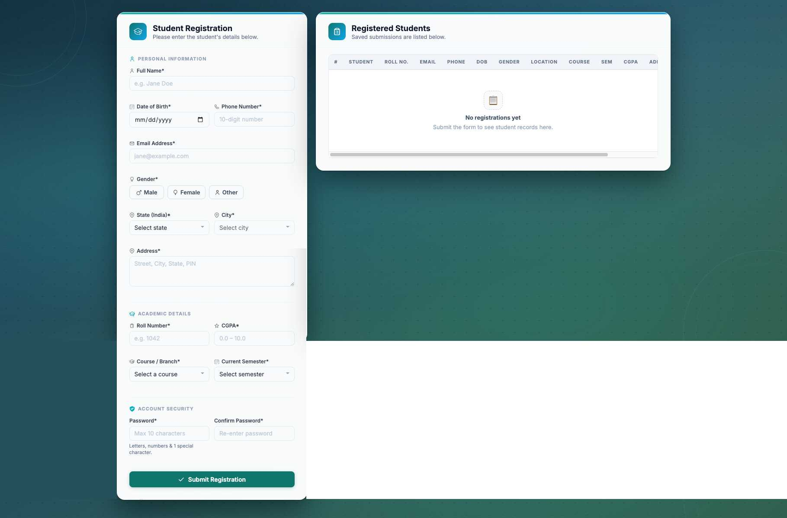
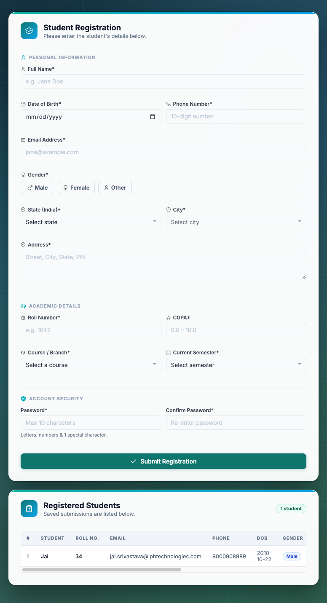

# Student Registration Form – HTML, CSS & JavaScript Project

## Introduction

Student Registration Form is a clean and responsive **frontend form application** built with **HTML5, CSS3, and vanilla JavaScript**.  
It is designed to collect student details, validate inputs in real time, and display submissions in a structured records table with edit and delete actions.

This project demonstrates practical frontend skills such as **form validation**, **dynamic dropdown handling**, **DOM manipulation**, and **responsive UI layout** without any frameworks.

---

## Screens Included

- **Registration Form Panel**: Personal, academic, and security sections
- **Records Table Panel**: Displays all submitted students
- **Edit Flow**: Update any existing student entry directly from the table
- **Delete Flow**: Remove records with confirmation prompt
- **Empty State UI**: Friendly placeholder when no records exist

---

## Features

### Registration Form

- Multi-section student registration form
- Real-time input sanitization and validation
- Field-level error messages
- Password validation with complexity rule
- Confirm password matching

---

### Location Selection

- State and city dropdowns for India
- City list updates dynamically based on selected state
- Prevents invalid state/city combinations

---

### Records Table

- Auto-renders all submitted records
- Student count chip with plural/singular handling
- Styled pills for gender and course
- Edit and delete actions for each row
- Empty-state message when no records are present

---

### UI and UX

- Two-panel layout (form + records)
- Sticky registration form on larger screens
- Smooth and responsive design for mobile and desktop
- Visual feedback for success and validation states
- Decorative icon-based background and modern card styling

---

## Prerequisites

- Any modern web browser (Chrome, Edge, Firefox, Safari)
- No build tools required

---

## Tech Stack

- HTML5
- CSS3
- Vanilla JavaScript (ES6)
- Google Fonts (Inter)

---

## Project Structure

```text
StudentRegistration_Form/
├── index.html
├── README.md
├── .gitignore
└── assets/
    ├── css/
    │   └── styles.css
    ├── data/
    │   └── Indian Cities Geo Data.csv
    ├── js/
    │   └── app.js
    └── images/
        ├── bg-icons/
        └── ui-icons/
```

---

## How to Run

1. Clone or download this repository.
2. Keep the dataset file at `assets/data/Indian Cities Geo Data.csv`.
3. Open `index.html` using a simple local server (for example, VS Code Live Server).
4. Fill the form and submit to see records in the table.

---

## Location Dataset Notes

- The app reads location data directly from `assets/data/Indian Cities Geo Data.csv`.
- The state and city columns are detected automatically from common header names.
- States and cities are deduplicated and sorted alphabetically in JavaScript.
- If the CSV file is missing or empty, state/city fields stay disabled.
- If you open the file directly with `file://`, some browsers block CSV loading; use a local server.

---

## License

This project is created for **learning and portfolio purposes**.

---

## Contributing

Contributions are welcome.  
If you find any bugs or UI issues, feel free to open an issue or submit a pull request.

---

## Support

If you face any validation, layout, or responsiveness issues, feel free to reach out.

---

## Acknowledgements

Thanks to the frontend developer community for inspiration around accessible forms, clean UI structure, and practical JavaScript patterns.

---

## Screenshots

**Desktop View**



**Reduced Screen View**



---

## Demo Video

[Watch Demo on ScreenPal](https://go.screenpal.com/watch/cOeXXlnZaqf)
